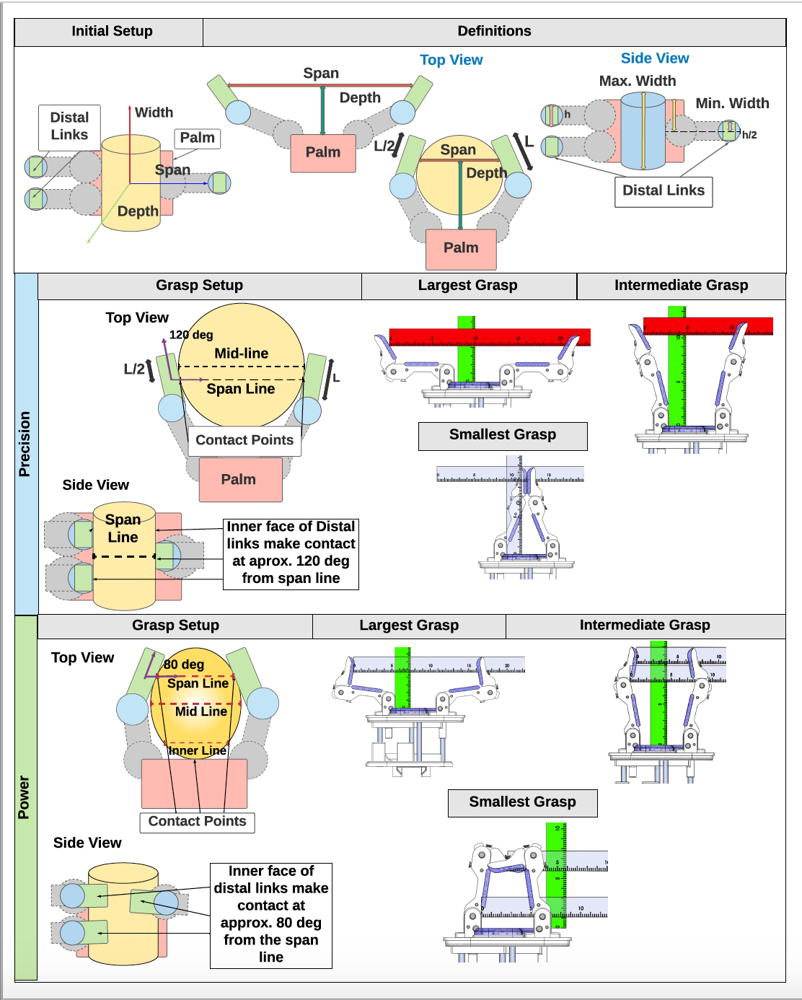

# Hand Measurement Instructions for Precision Grasp

## Initial Hand Positioning

Position robot end-effector as if it were to grasp a cylinder on a table top (as shown in the Figure). This can be done with or without an actual cylindrical object --- the main point is that the hand is set up in this fashion. We will refer to this cylindrical object as the reference cylinder.

Using the reference cylinder, assign the axes to the hand.

# Precision Grasp Measurements

To measure the hand dimensions on a precision grasp, one must make three measurements at three different finger positions --- which we will use to build a complete span-depth profile of the hand throughout the hand's actuation.

All distal link measurements are made at the center point of the distal link.

To make these measurements, perform the following steps:

1. ***Initial Setup:*** Place hand in correct position, as described above.
2. ***Position 0:*** Open the end effector fingers as much as possible.
3. ***Max Span Limit:*** Measure the total distance in the span axis between the midpoint of the distal links that will grasp the cylinder on each side.
4. ***Measurement Image Set 0:*** Take a top-down and side-profile image of the hand's pose. 
5. ***Position 1:*** Close the fingers such that the end effector can grasp the largest reference cylinder that can fit between the distal links, ignoring that such a reference cylinder size could collide with the proximal or palm contacts. 
 	- **Note:** As a guideline, consider actuating the distal links such that they are as far apart as possible, and up to 120 degrees angle from the palm.
    - One could also consider that the distal link contacts on the reference cylinder should be below the mid-line of the cylinder face, as shown in both Cylindrical and Spherical Figures. 
6. ***Span Measurement 1:*** Measure the total distance in the span axis between the distal links, as before. 
7. ***Depth Measurement 1:*** Keeping the same position, now measure the total distance orthogonal to the palm up to the span line (remember, this is to the midpoint of the distal link where you measured span). 
8. ***Max Width Measurement:*** Measure the maximum width, choosing between the two width calculations by configuration type that apply best to the hand.
9. ***Min Width Measurement:*** Measure the minimum width, choosing between the two width calculations by configuration type that apply best to the hand.
	- If the fingers are positioned in such a way that they do not obstruct a taller object from bring grasped, add a plus sign after the measurement to indicate this.
    - See the top of Figures Cylindrical and Spherical as a reference.
9. ***Measurement Image Set 1***: Take a top-down and side-profile image of the hand's pose.
10. ***Position 2:*** Now minimize the distance between the distal links.
11. ***Span Measurement 2:*** Measure the span at this position.
12. ***Depth Measurement 2:*** Measure the depth at this position.
13. ***Measurement Image Set 2:*** Take a top-down and side-profile image of the hand's pose.
14. ***Positions and Measurements 3+:*** Now choose at least one more finger position between positions 1 and 2 to measure hand span and depth
15. ***Measurement Image Sets 3+:*** Make sure that for every measurement you take a top-down and side-profile image of the hand's pose.
16. ***Final Steps:*** Plot the span and depth values with span as the x-axis. Plot the Max Span Limit as a dotted line to indicate the how far the hand can open.

