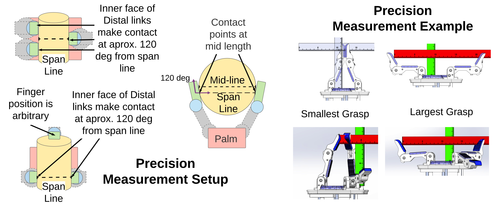
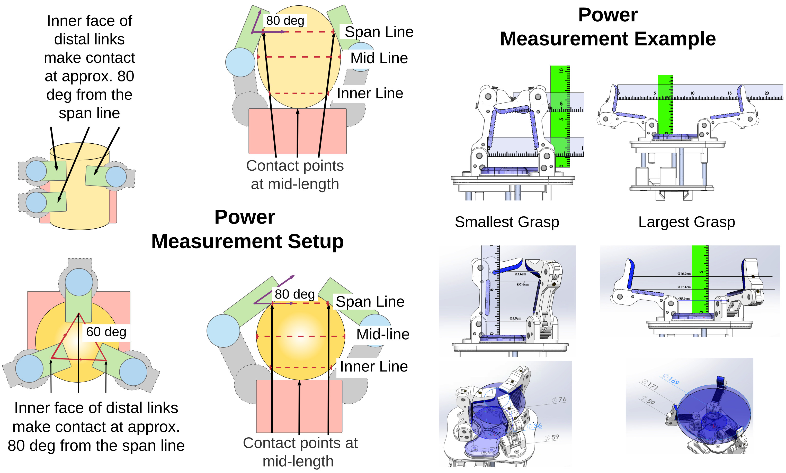

# Applied Hand Dimensions

A common wish amongst grasping and manipulation researchers is to use universal benchmarks to characterize robot hand performance (see: [1](https://scholar.google.com/scholar?hl=en&as_sdt=0%2C39&q=Robotic+research%3A+are+we+applying+the+scientific+method%3F&btnG=) & [2](https://scholar.google.com/scholar?hl=en&as_sdt=0%2C39&q=Guest+editorial+open+discussion+of+robot+grasping+benchmarks%2C+protocols%2C+and+metrics&btnG=) ) - similar to the fields of Computer Vision and Graphics. However, unlike these fields, robot grasping and manipulation involve a hardware interaction between hands and objects. Currently, the field lacks an established vocabulary for characterizing this interaction, which makes it difficult to establish universal, quantitative benchmarks.

So far researchers have worked around this problem by using object sets (such as the 
[YCB]([bib:ycb-objectset](https://scholar.google.com/scholar?q=The%20ycb%20object%20and%20model%20set%3A%20Towards%20common%20benchmarks%20for%20manipulation%20research&btnG=Search&as_sdt=800000000001&as_sdtp=on)) & [Generic Sensorized]([bib:sensorized-objectset}](https://scholar.google.com/scholar?hl=en&as_sdt=0%2C39&q=Modular%2C+Accessible%2C+Sensorized+Objects+for+Evaluating+the+Grasping+and+Manipulation+Capabilities+of+Grippers+and+Hands&btnG=)) object sets) and simple task-based measures to characterize a robot hand's capabilities (see [Role of Task in Metric of Success](https://scholar.google.com/scholar?q=Robotic%20manipulation%20and%20the%20role%20of%20the%20task%20in%20the%20metric%20of%20success&btnG=Search&as_sdt=800000000001&as_sdtp=on)). Unfortunately, there is no accepted standard and so researchers present a unique set of characterizing results to communicate each hand design ideas. Even something as simple as characterizing in-hand manipulation of a cube presents challenges because there is no clear definition of a ``normal'' sized cube since it depends on the hand's overall size *and* manipulation space.

We take a step towards a standard characterization method by clearly defining the characteristics of two common grasps --- precision and power (see [GRASP Taxonomy]([~\cite{bib:grasp-taxonomy}](https://scholar.google.com/scholar?hl=en&as_sdt=0%2C39&q=A+comprehensive+grasp+taxonomy&btnG=))) and how to measure their manipulation space. This addresses two specific problems: 1) How to quantitatively measure and compare an object's size in relation to a hand's size and 2) Measuring and communicating, in a human intuitive way, how a hand actuates and the range of object volumes it can grasp across actuation. 

Our first problem is immediately apparent when considering the simple task of defining a small, medium, or large object for a robot hand in a generalized way. A simple solution is to provide a formula for normalizing an object's size to the hand's. This is currently challenging because there is no consensus on what hand measurements to normalize to, nor is there a consensus on what ``small'' means. Although it is tempting to simply measure the hand in a rest state, this introduces various problems since the hand may not be able to grasp an object in this state. Our approach, therefore, is to define a functional task (holding a canonical object) and performing the measurements based on that configuration.

Our second problem relates to the field's lack of functional* characterization methods. This is evident when buying robot hands. Often, the description is just the dimensions of the hand. This does little to define its actuation and the range of object sizes it can actually grasp. Unfortunately, kinematic spaces can be complex, especially for underactuated hands. And a complete characterization would create a confusing and complex representation. We propose, instead, to represent the most salient areas of the hand's kinematic workspace in a human readable way. For this, we turn to the notion of *power* and *precision* grasps. We provide *functional* definitions of these grasps and descriptive (rather than prescriptive) methods for measurement. Although this approach leaves some room for interpretation on the part of the one measuring, we feel that this flexibility is necessary in order to support characterization of the wide variety of available hand morphologies.

One final goal of our approach is to find a balance between conciseness and descriptiveness. We also aim to limit the total measuring time to half an hour. Our measurements are also applicable to CAD models additional to physical hands (both actuated and unactuated designs- to enable comparison before adding actuation). 

## Navigating this repo

We include both instructions for our method and a functional demonstration of our measurements in this repository. 

### Instructions
In the instructions folder are three sets of instructions, which contain instructions of our measurements applied to three common grasping scenarios:
* Precision Grasp
* Power Grasp, Cylindrical
* Power Grasp, Spherical 

### Functional Demonstration
The results folder has measurements for the following hands:
* Openhand Model O ([link](https://www.eng.yale.edu/grablab/openhand/model_o.html)) in two configurations:
  * 'cylindrical' configuration
  * 'spherical' configuration
* Openhand Model T42 ([link](https://www.eng.yale.edu/grablab/openhand/model_t42.html))
* (*coming soon*) Robotiq 2F-85 ([link](https://robotiq.com/products/2f85-140-adaptive-robot-gripper))
* (*coming soon*) Kinova Jaco 2 hand ([link](https://www.kinovarobotics.com/en/products/assistive-technologies/kinova-jaco-assistive-robotic-arm))

## Future plans
We plan to convert this repository into a reference database of hand measurements. More information coming soon.
