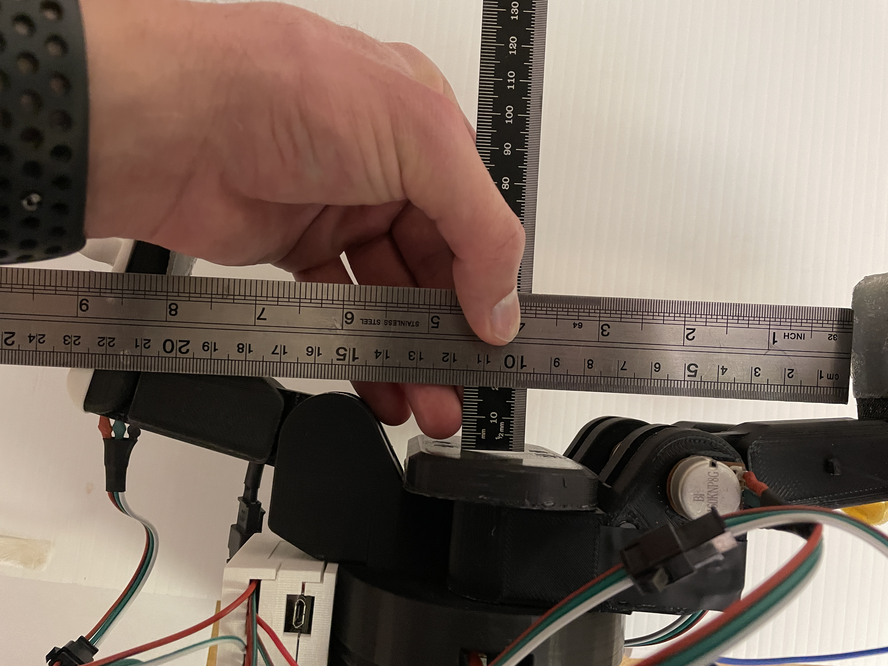
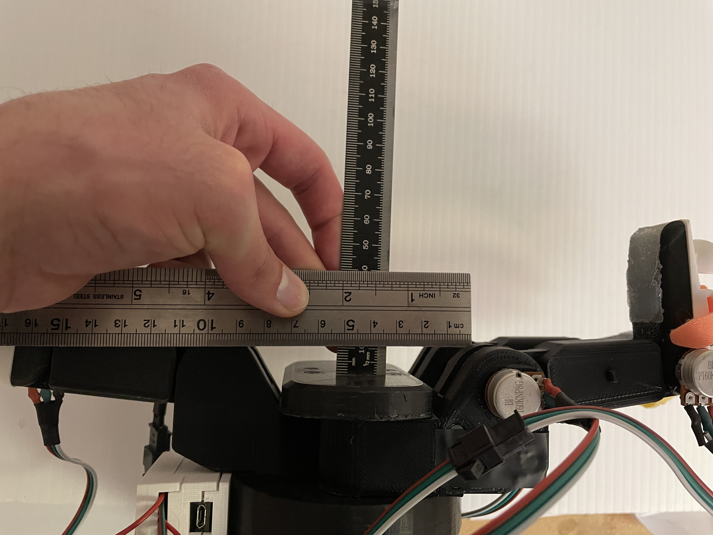
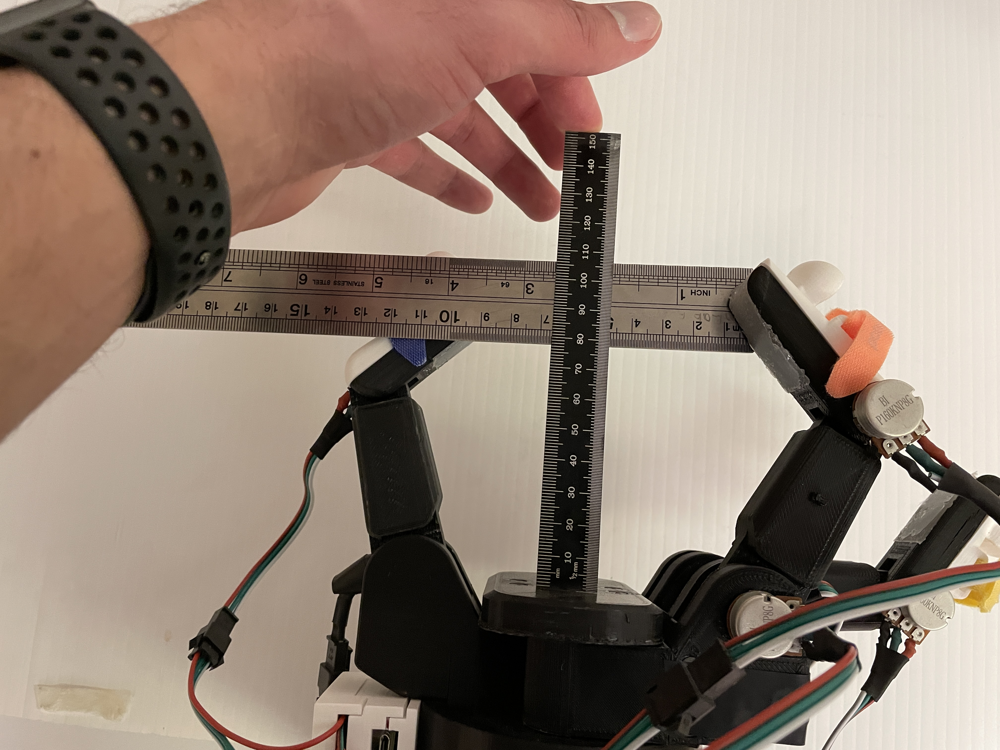
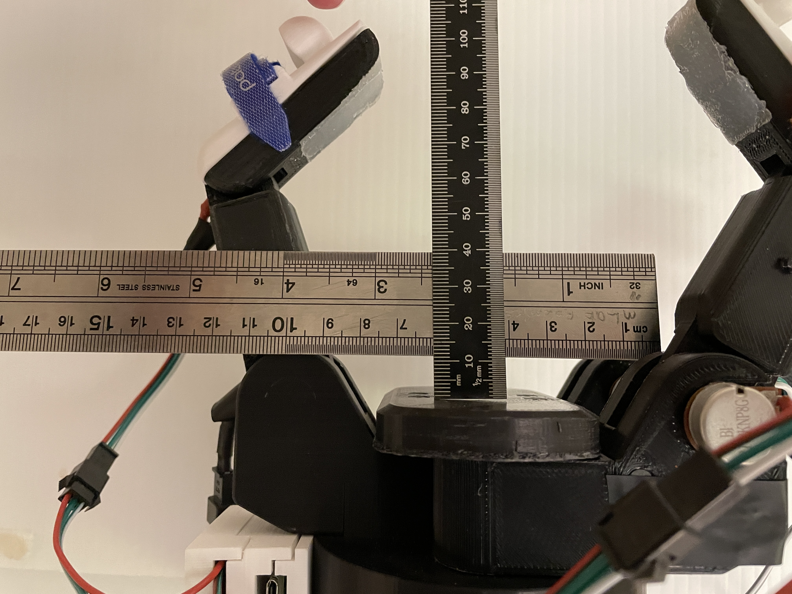
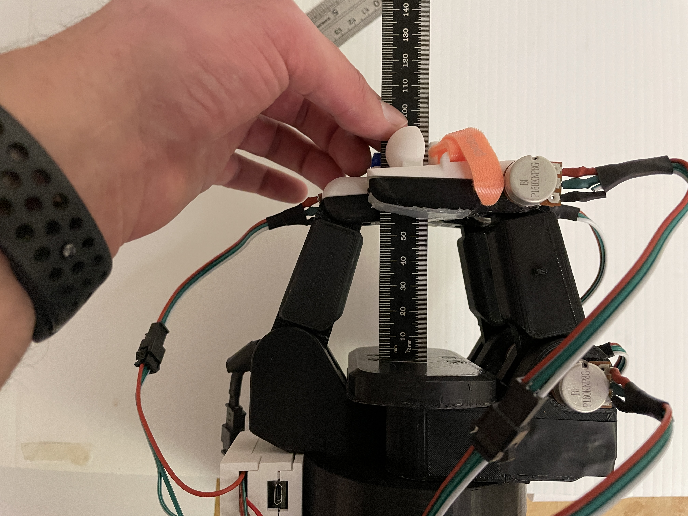
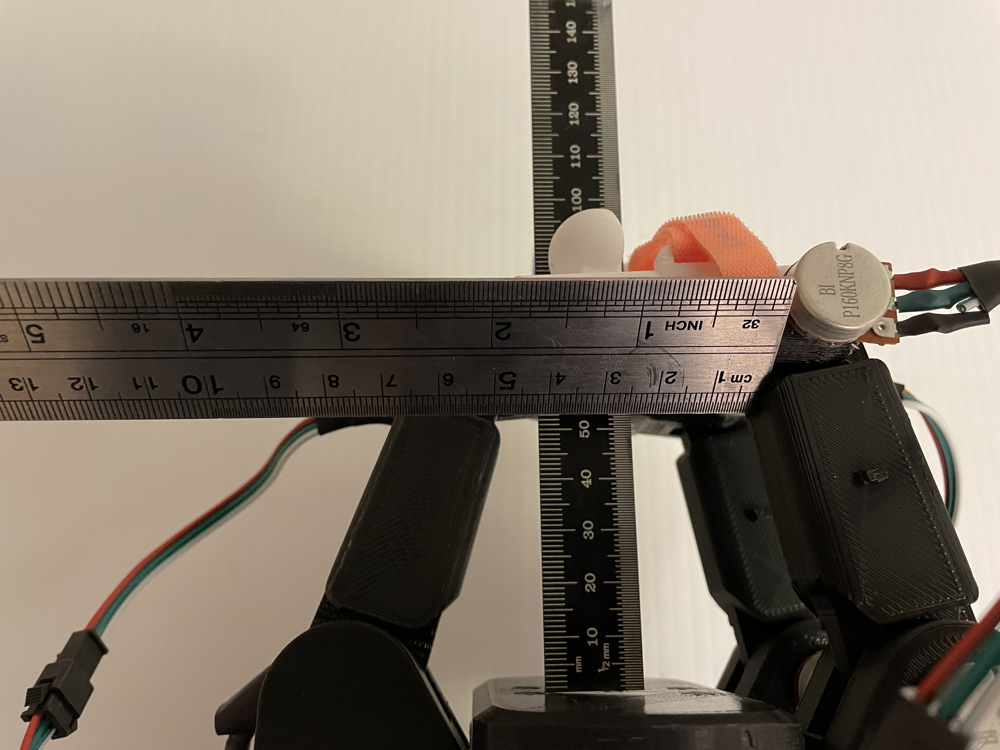
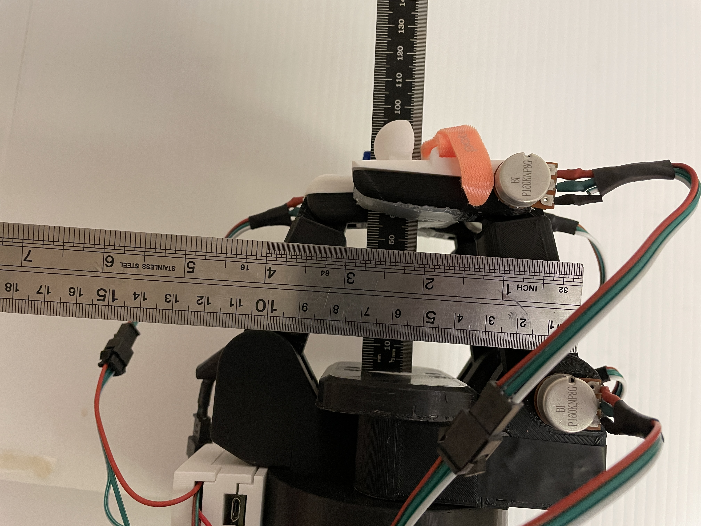

# Barrett Power Grasp Measurments

### Max Span with Distals at 10 Degrees Inwards

Distal: Span = 20.8cm Depth = 3.5cm  
Widest: Span = 21.5cm Depth = 1.5cm  
Base: Span = 9.5cm Depth = 1.2cm  
    
 

### Mid Span

Distal: Span = 9.9cm Depth = 7.2cm  
Widest: Span = 13.5cm Depth = 5.6cm  
Base: Span = 9.5cm Depth = 1.2cm  
    
 

### Min Span

Distal: Span = 0.0cm Depth = 5.9cm  
Widest: Span = 5.0cm Depth = 5.1cm  
Base: Span = 9.5cm Depth = 1.2cm  
    
