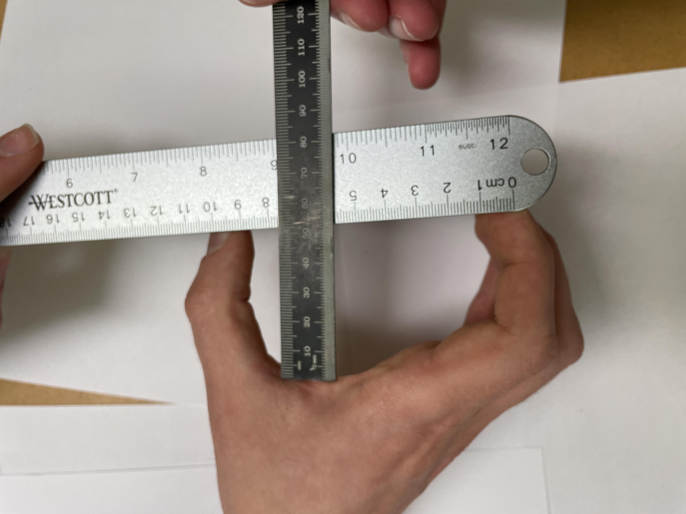
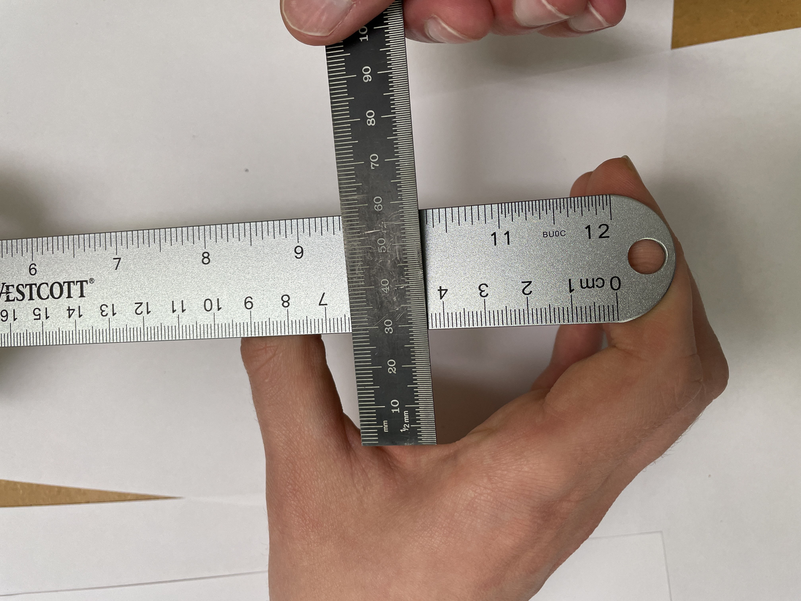
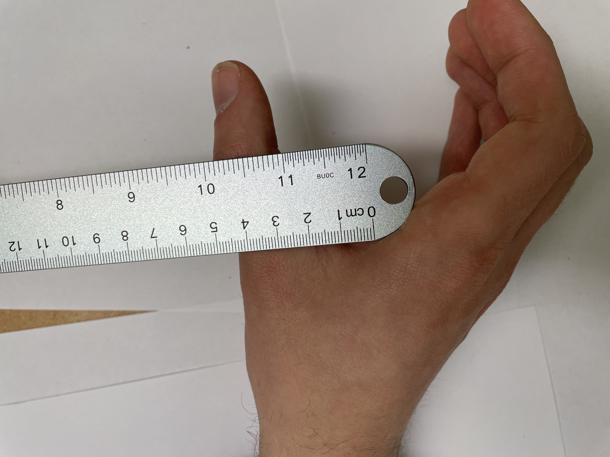
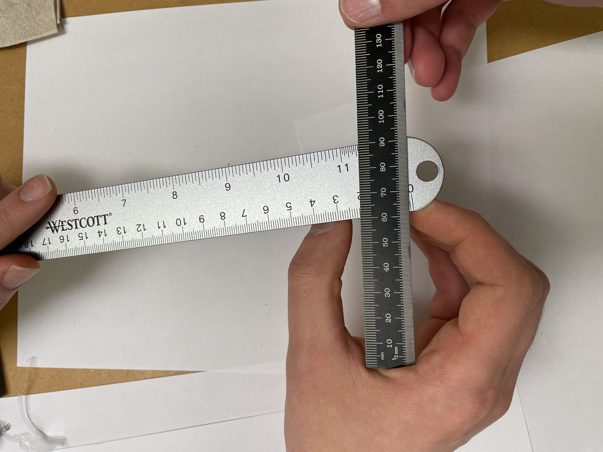
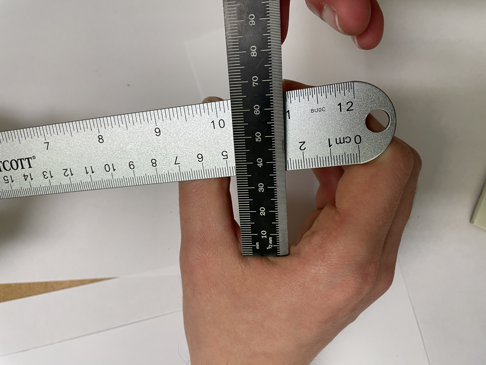
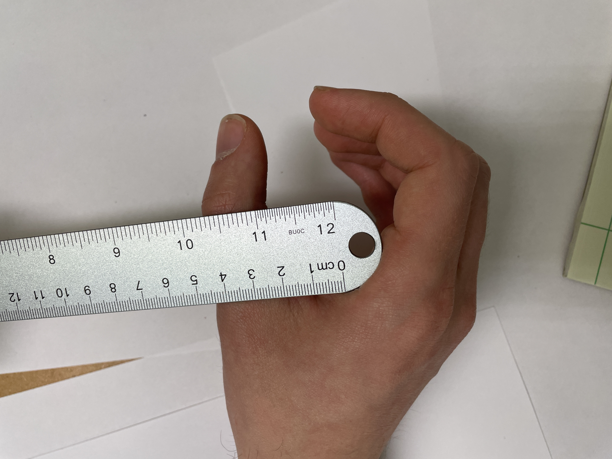
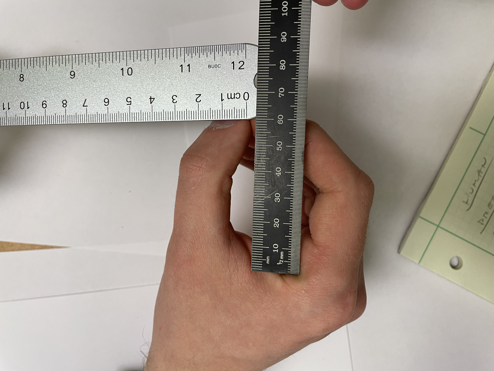
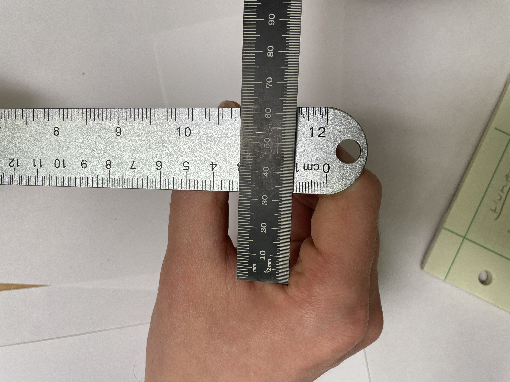
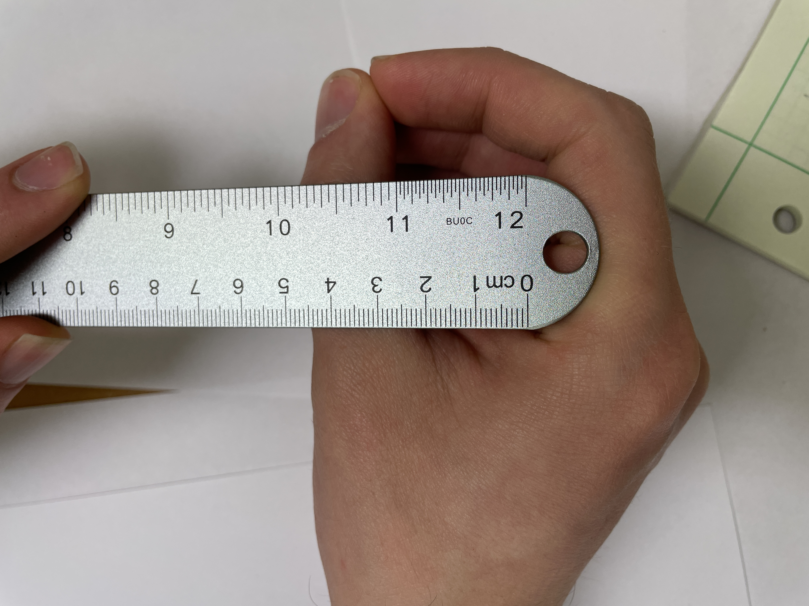

# Human Hand Power Grasp Measurments

### Max Pose with Distals at 10 Degrees Inwards

Distal: Span = 9.4cm Depth = 5.1cm  
Mid: Span = 7.5cm Depth = 2.9cm  
Base: Span = 2.0cm Depth = 0.0cm  
    
 

### Intermediate Pose

Distal: Span = 2.6cm Depth = 6.0cm  
Mid: Span = 5.3cm Depth = 3.4cm  
Base: Span = 2.0cm Depth = 0.0cm  
    
 

### Min Pose

Distal: Span = 0.0cm Depth = 5.6cm  
Mid: Span = 4.0cm Depth = 3.3cm  
Base: Span = 2.1cm Depth = 0.0cm  
    
