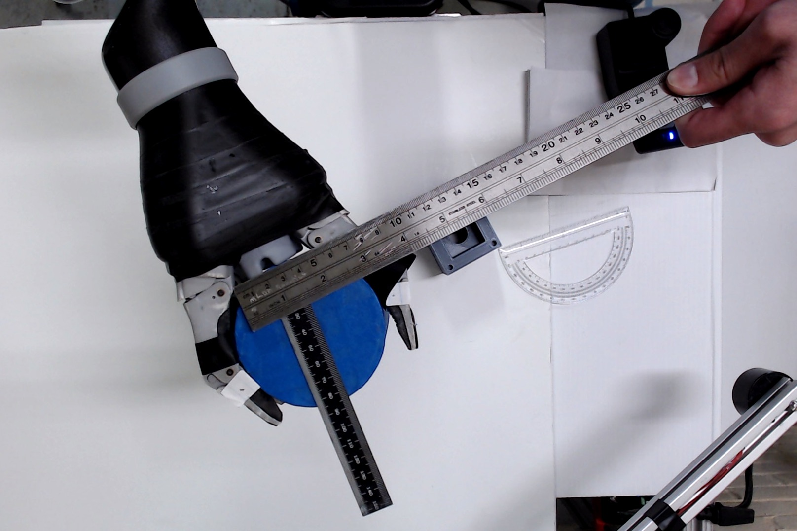
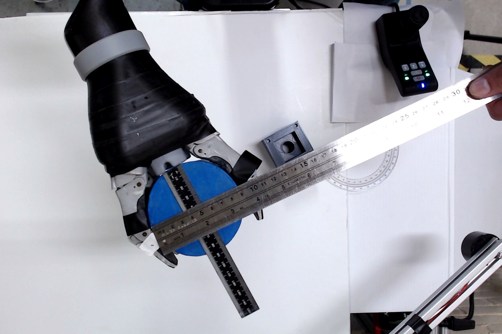
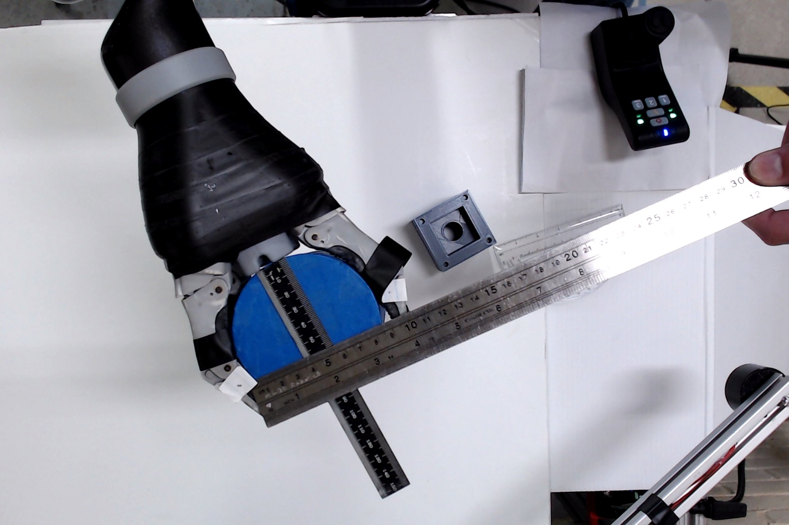
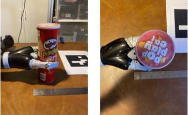
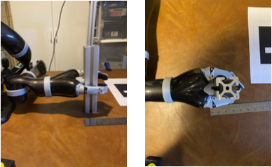

# Jaco2 Power Grasp Measurments

### Max Span with Distals at 10 Degrees Inwards

Distal: Span = 7.8cm Depth = 5.7cm  
Widest: Span = 9.2cm Depth = 4.1cm  
Base: Span = 4.0cm Depth = 0.0cm  
    
 

### Mid Span

Distal: Span = 7.0cm Depth = 7.0cm  
Widest: Span = 8.0cm Depth = 4.0cm  
Base: Span = 4.0cm Depth = 0.0cm  
  
 

### Min Span

Distal: Span = 0.0cm Depth = 8.0cm  
Widest: Span = 4.0cm Depth = 4.0cm  
Base: Span = 4.0cm Depth = 0.0cm  
  
