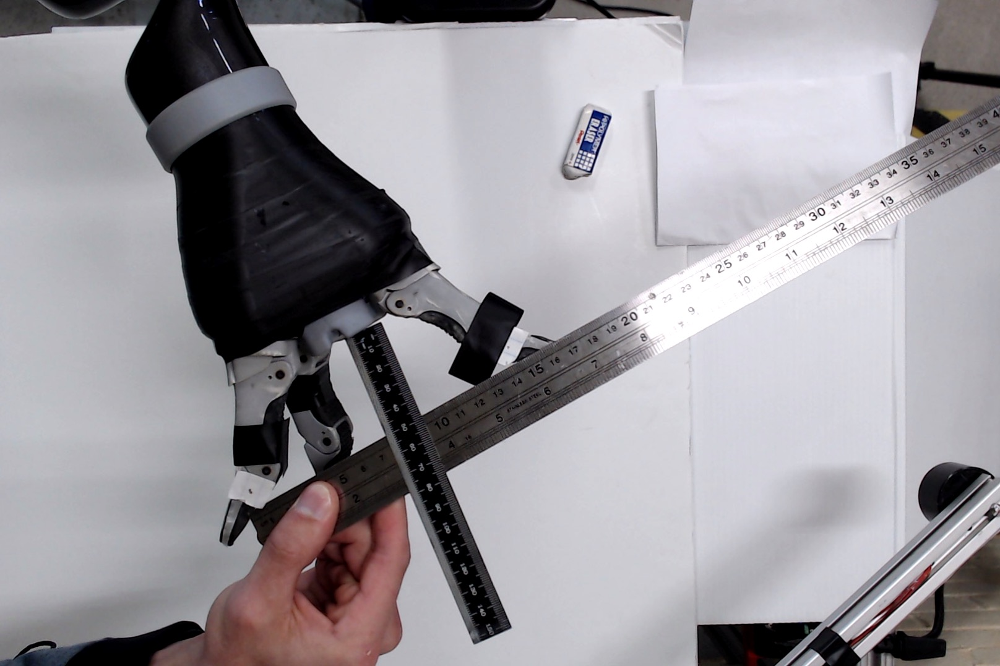
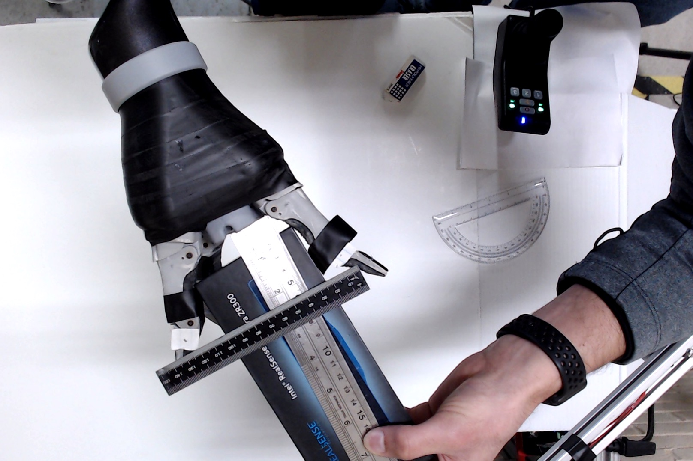
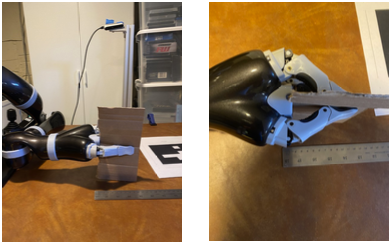

# Jaco2 Precision Grasp Measurments

### Abs. Max Span

Span = 14.5cm
Depth = 5.0cm

### Max Span with Distals at 30 Degrees

Span = 12.5cm
Depth = 5.9cm

### Mid Span

Span = 7.75cm
Depth = 6.6cm

### Min Span

Span = 0.0cm
Depth = 7.5cm
