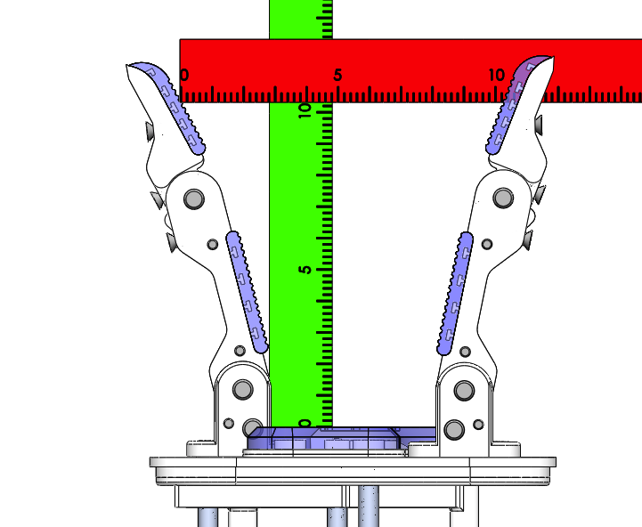
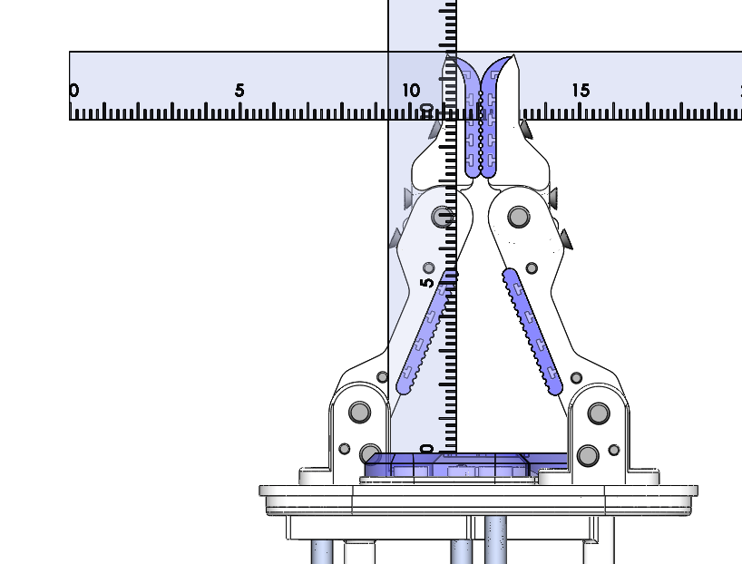

# Model O Configuration A Power Grasp Measurments

### Max Span with Distals at 10 Degrees Inwards

Span = 20.5cm
Depth = 4.2cm

### Mid Span

Span = 10.25cm
Depth = 10.3cm

### Min Span

Span = 0cm
Depth = 9.8cm
