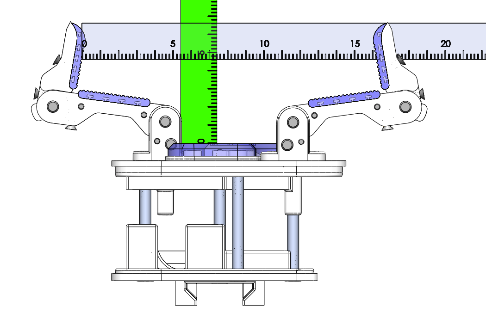
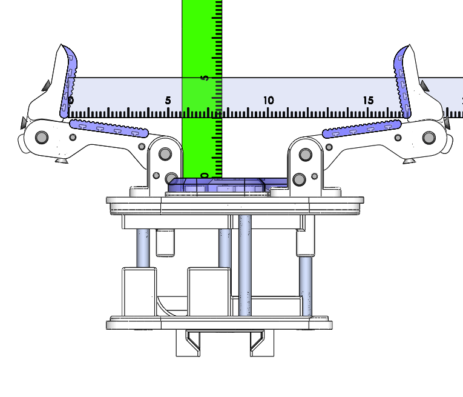
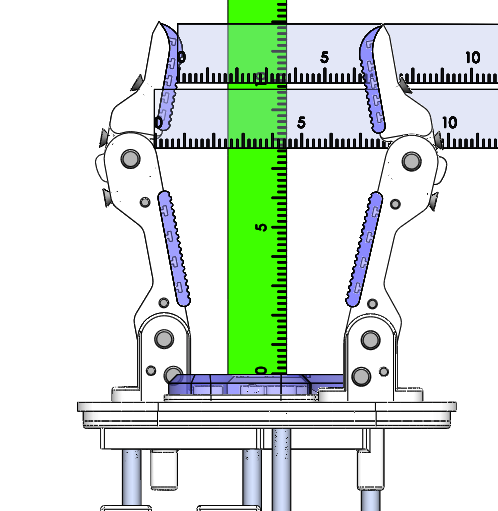

# Model O Configuration A Power Grasp Measurments

### Max Span with Distals at 10 Degrees Inwards
 

Distal: Span = 16.2cm Depth = 4.6cm

Widest: Span = 16.7cm Depth = 3cm

Base: Span = 5.2cm Depth = 1.1cm

### Mid Span

Distal: Span = 6.3cm Depth = 9.9cm

Widest: Span = 7.8cm Depth = 7.7cm

Base: Span = 5.2cm Depth = 1.1cm

### Min Span

Distal: Span = 0.0cm Depth = 5.8cm

Widest: Span = 3.6cm Depth = 5.6cm

Base: Span = 5.2cm Depth = 1.1cm
