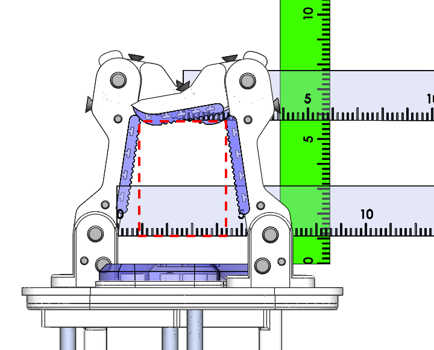

# Model O Configuration A Power Grasp Measurments

### Max Span with Distals at 10 Degrees Inwards

Distal: Span = 16.2cm Depth = 4.6cm  
Widest: Span = 16.7cm Depth = 3cm  
Base: Span = 5.2cm Depth = 1.1cm  
   
 

### Mid Span

Distal: Span = 6.3cm Depth = 9.9cm  
Widest: Span = 7.8cm Depth = 7.7cm  
Base: Span = 5.2cm Depth = 1.1cm  
  
 

### Min Span

Distal: Span = 0.0cm Depth = 5.8cm  
Widest: Span = 3.6cm Depth = 5.6cm  
Base: Span = 5.2cm Depth = 1.1cm  
  
(The red dashed square is used to obtain widest measurments from the ruler on the base)
