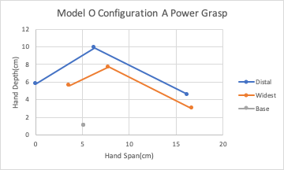
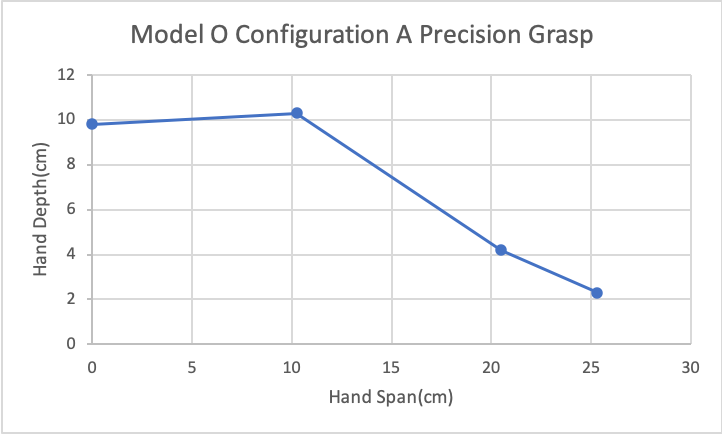

# Results Of Model O Configuration A Measurements

<image>

</image>
<table>
    <thead>
        <tr>
            <th colspan=7> Model O Configuration A Power Grasp </th>
        </tr>
    </thead>
    <tbody>
        <tr>
            <th rowspan=2> </th>
            <th colspan=2> Distal </th>
            <th colspan=2> Widest </th>
            <th colspan=2> Base </th>
        </tr>
        <tr>    
            <td colspan=1> Span </td>
            <td colspan=1>Depth</td>
            <td colspan=1>Span</td>
            <td colspan=1>Depth</td>
            <td colspan=1>Span</td>
            <td colspan=1>Depth</td>
        </tr>
        <tr>
            <td colspan=1> Max </td>
            <td colspan=1> 16.2 </td>
            <td colspan=1> 4.6 </td>
            <td colspan=1> 16.7 </td>
            <td colspan=1> 3 </td>
            <td colspan=1> 5.2 </td>
            <td colspan=1> 1.1 </td>
        </tr>
        <tr>
            <td colspan=1> Mid </td>
            <td colspan=1> 6.3 </td>
            <td colspan=1> 9.9 </td>
            <td colspan=1> 7.8 </td>
            <td colspan=1> 7.7 </td>
            <td colspan=1> 5.2 </td>
            <td colspan=1> 1.1 </td>
        </tr>
        <tr>
            <td colspan=1> Min </td>
            <td colspan=1> 0 </td>
            <td colspan=1> 5.8 </td>
            <td colspan=1> 3.6 </td>
            <td colspan=1> 5.6 </td>
            <td colspan=1> 5.2 </td>
            <td colspan=1> 1.1 </td>
        </tr>
    </tbody>
</table>

<image>

</image>

<table>
    <thead>
        <tr>
            <th colspan=7> Model O Configuration A Precision Grasp </th>
        </tr>
    </thead>
    <tbody>
        <tr>           
            <td colspan=1> </td>
            <td colspan=1> Span </td>
            <td colspan=1>Depth</td>
        </tr>
        <tr>
            <td colspan=1> Full Max </td>
            <td colspan=1> 25.3 </td>
            <td colspan=1> 2.3 </td>
        </tr>
        <tr>
            <td colspan=1> Max </td>
            <td colspan=1> 20.5 </td>
            <td colspan=1> 4.2 </td>
        </tr>
        <tr>
            <td colspan=1> Mid </td>
            <td colspan=1> 10.25 </td>
            <td colspan=1> 10.3 </td>
        </tr>
        <tr>
            <td colspan=1> Min </td>
            <td colspan=1> 0 </td>
            <td colspan=1> 9.8 </td>
        </tr>
    </tbody>
</table>
