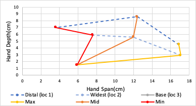
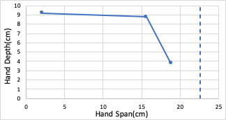

# Results of Model O Configuration B Measurements

<image>

</image>

<table>
    <thead>
        <tr>
            <th colspan=7> Model O Configuration B Power Grasp </th>
        </tr>
    </thead>
    <tbody>
        <tr>
            <th rowspan=2> </th>
            <th colspan=2> Distal </th>
            <th colspan=2> Widest </th>
            <th colspan=2> Base </th>
        </tr>
        <tr>
            <td colspan=1> Span </td>
            <td colspan=1>Depth</td>
            <td colspan=1>Span</td>
            <td colspan=1>Depth</td>
            <td colspan=1>Span</td>
            <td colspan=1>Depth</td>
        </tr>
        <tr>
            <td colspan=1> Max </td>
            <td colspan=1> 16.9 </td>
            <td colspan=1> 4.5 </td>
            <td colspan=1> 17.1 </td>
            <td colspan=1> 2.9 </td>
            <td colspan=1> 5.9 </td>
            <td colspan=1> 1.5 </td>
        </tr>
        <tr>
            <td colspan=1> Mid </td>
            <td colspan=1> 12.4 </td>
            <td colspan=1> 8.6 </td>
            <td colspan=1> 12 </td>
            <td colspan=1> 5.6 </td>
            <td colspan=1> 5.9 </td>
            <td colspan=1> 1.5 </td>
        </tr>
        <tr>
            <td colspan=1> Min </td>
            <td colspan=1> 3.6 </td>
            <td colspan=1> 7 </td>
            <td colspan=1> 7.6 </td>
            <td colspan=1> 5.9 </td>
            <td colspan=1> 5.9 </td>
            <td colspan=1> 1.5 </td>
        </tr>
    </tbody>
</table>

 <image>

</image>

<table>
    <thead>
        <tr>
            <th colspan=7> Model O Configuration B Precision Grasp </th>
        </tr>
    </thead>
    <tbody>
        <tr>           
            <td colspan=1> </td>
            <td colspan=1> Span </td>
            <td colspan=1>Depth</td>
        </tr>
        <tr>
            <td colspan=1> Full Max </td>
            <td colspan=1> 22.6 </td>
            <td colspan=1> 3 </td>
        </tr>
        <tr>
            <td colspan=1> Max </td>
            <td colspan=1> 18.8 </td>
            <td colspan=1> 3.8 </td>
        </tr>
        <tr>
            <td colspan=1> Mid </td>
            <td colspan=1> 15.6 </td>
            <td colspan=1> 8.8 </td>
        </tr>
        <tr>
            <td colspan=1> Min </td>
            <td colspan=1> 2.1 </td>
            <td colspan=1> 9.2 </td>
        </tr>
    </tbody>
</table>
