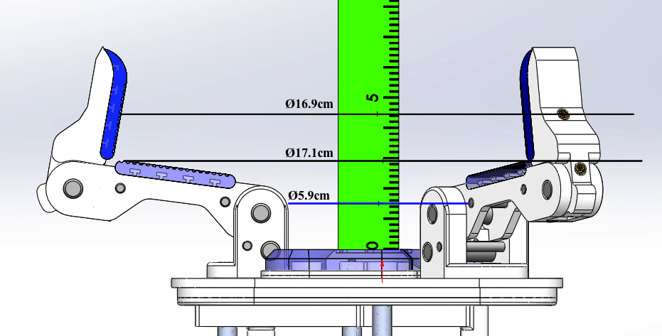
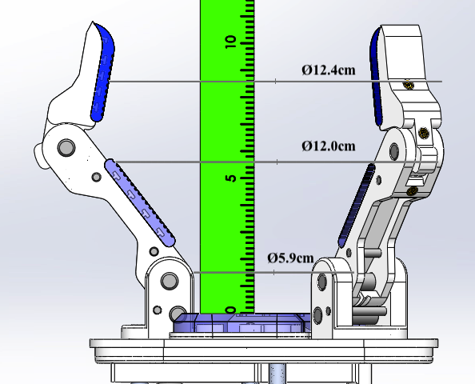
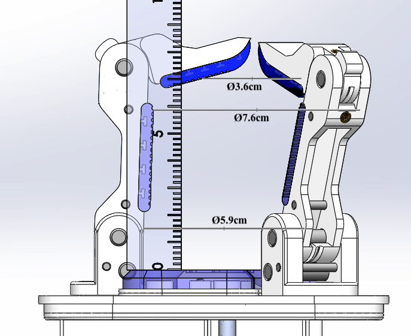

# Model O Spherical Power Grasp Measurments

### Max Pose with Distals at 10 Degrees Inwards

Distal: Span = 16.9cm Depth = 4.5cm

Mid: Span = 17.1cm Depth = 2.9cm

Base: Span = 5.9cm Depth = 1.5cm

### Intermediate Pose

Distal: Span = 12.4cm Depth = 8.6cm

Mid: Span = 12cm Depth = 5.6cm

Base: Span = 5.9cm Depth = 1.5cm

### Min Pose

Distal: Span = 7cm Depth = 3.6cm

Mid: Span = 7.6cm Depth = 5.9cm

Base: Span = 5.9cm Depth = 1.5cm
