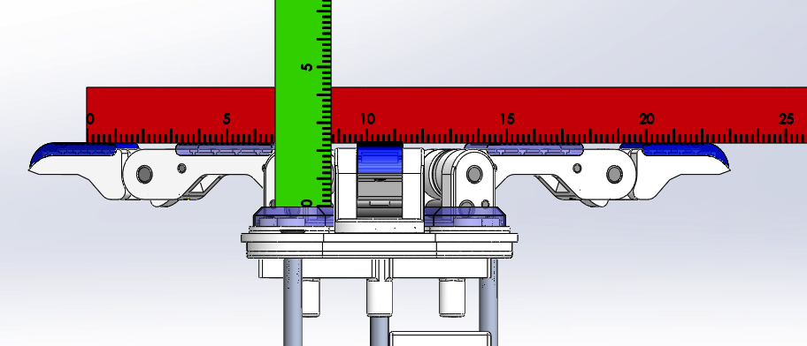
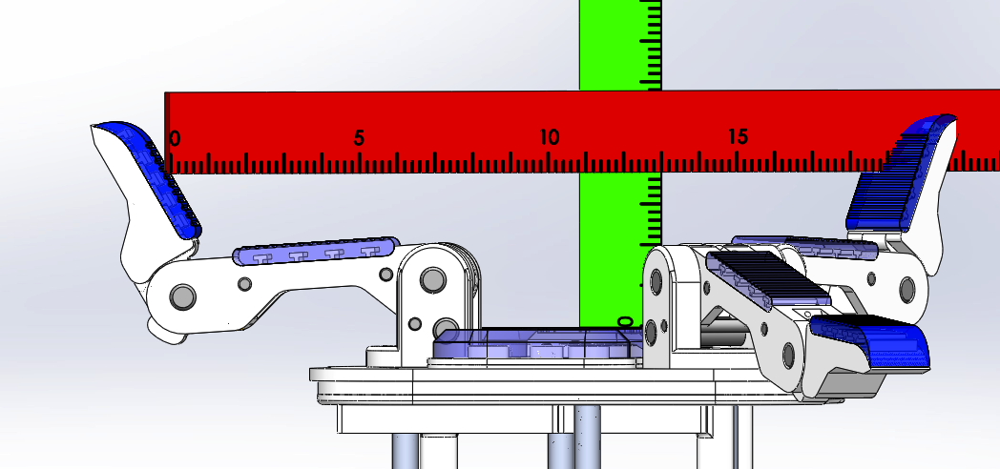
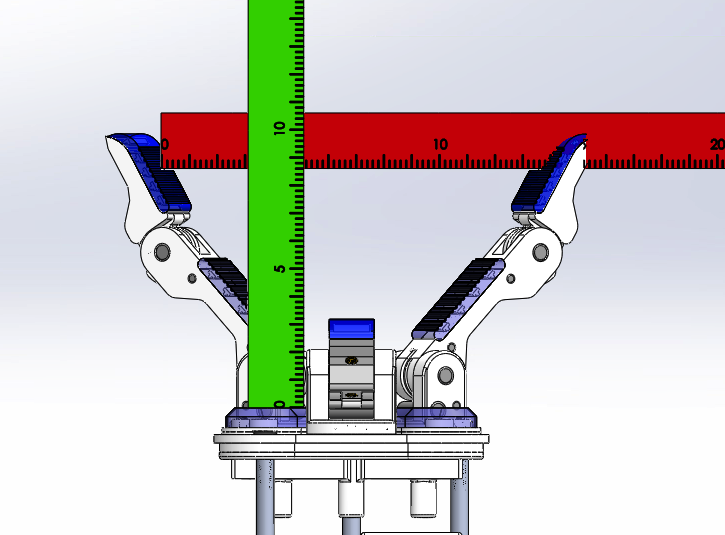
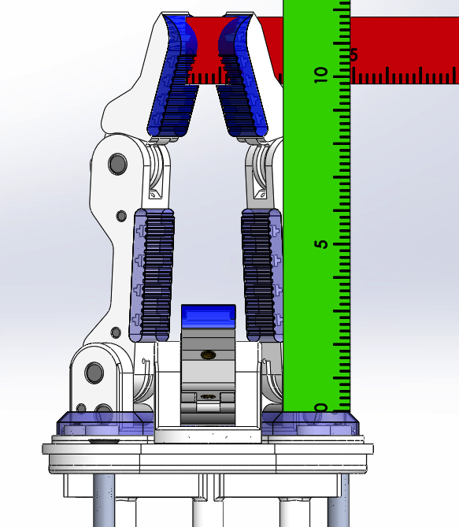

# Model O Spherical Precision Grasp Measurments

### Full Max Span

Span = 22.6cm
Depth = 3cm

### Max Span with Distals at 30 Degrees

Span = 18.8cm
Depth = 3.8cm

### Mid Span

Span = 15.6cm
Depth = 8.8cm

### Min Span

Span = 2.1cm
Depth = 9.2cm
