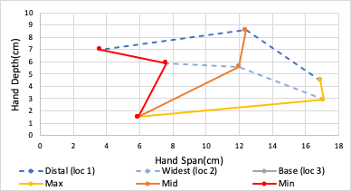
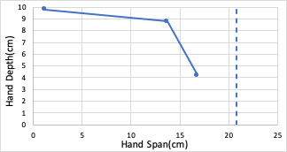

# Results of Model O Spherical Measurements

### Power Grasp
<image>

</image>

<table>
    <thead>
        <tr>
            <th colspan=7> Model O Spherical Power Grasp </th>
        </tr>
    </thead>
    <tbody>
        <tr>
            <th rowspan=2> Finger   Pose </th>
            <th colspan=2> Distal </th>
            <th colspan=2> Widest </th>
            <th colspan=2> Base </th>
        </tr>
        <tr>
            <th colspan=1> Span </th>
            <th colspan=1>Depth</th>
            <th colspan=1> Span </th>
            <th colspan=1>Depth</th>
            <th colspan=1> Span </th>
            <th colspan=1>Depth</th>
        </tr>
        <tr>
            <th colspan=1> Max </th>
            <td colspan=1> 16.9 </td>
            <td colspan=1> 4.5 </td>
            <td colspan=1> 17.1 </td>
            <td colspan=1> 2.9 </td>
            <td colspan=1> 5.9 </td>
            <td colspan=1> 1.5 </td>
        </tr>
        <tr>
            <th colspan=1> Mid </th>
            <td colspan=1> 12.4 </td>
            <td colspan=1> 8.6 </td>
            <td colspan=1> 12 </td>
            <td colspan=1> 5.6 </td>
            <td colspan=1> 5.9 </td>
            <td colspan=1> 1.5 </td>
        </tr>
        <tr>
            <th colspan=1> Min </th>
            <td colspan=1> 3.6 </td>
            <td colspan=1> 7 </td>
            <td colspan=1> 7.6 </td>
            <td colspan=1> 5.9 </td>
            <td colspan=1> 5.9 </td>
            <td colspan=1> 1.5 </td>
        </tr>
    </tbody>
</table>

### Precision Grasp

 <image>

</image>

<table>
    <thead>
        <tr>
            <th colspan=3> Model O Spherical Precision Grasp </th>
        </tr>
    </thead>
    <tbody>
        <tr>           
            <th colspan=1> Finger Pose </th>
            <th colspan=1> Span </th>
            <th colspan=1>Depth</th>
        </tr>
        <tr>
            <th colspan=1> Abs. Max </th>
            <td colspan=1> 20.8 </td>
            <td colspan=1> 2.3 </td>
        </tr>
        <tr>
            <th colspan=1> Max </th>
            <td colspan=1> 16.8 </td>
            <td colspan=1> 4.2 </td>
        </tr>
        <tr>
            <th colspan=1> Mid </th>
            <td colspan=1> 13.7 </td>
            <td colspan=1> 8.8 </td>
        </tr>
        <tr>
            <th colspan=1> Min </th>
            <td colspan=1> 1.3 </td>
            <td colspan=1> 9.8 </td>
        </tr>
    </tbody>
</table>
 

### Width: 
Max= 16.9cm Min= 1.5cm
 
