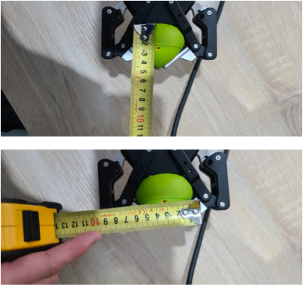
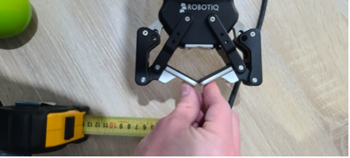

# Robotiq 2f-85 Power Grasp Measurments

### Max Pose

Distal: Span = 8.5cm Depth = 6.0cm  
Mid: Span = 8.5cm Depth = 4.5cm  
Base: Span = 4.5cm Depth = 0.0cm  
  
 

### Intermediate Pose

Distal: Span = 1.0cm Depth = 4.5cm  
Mid: Span = 6.0cm Depth = 3.2cm  
Base: Span = 4.0cm Depth = 0.0cm  
  
 

### Min Pose

Distal: Span = 0.0cm Depth = 3.2cm  
Mid: Span = 6.7cm Depth = 3.2cm  
Base: Span = 4.5cm Depth = 0.0cm  
  
