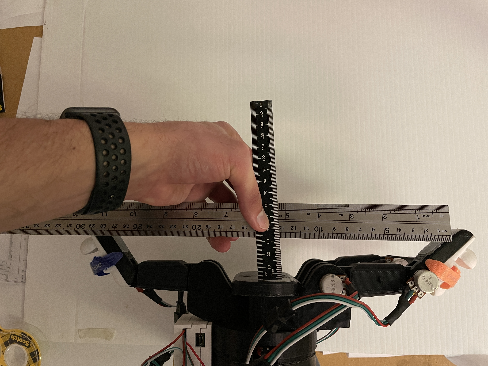
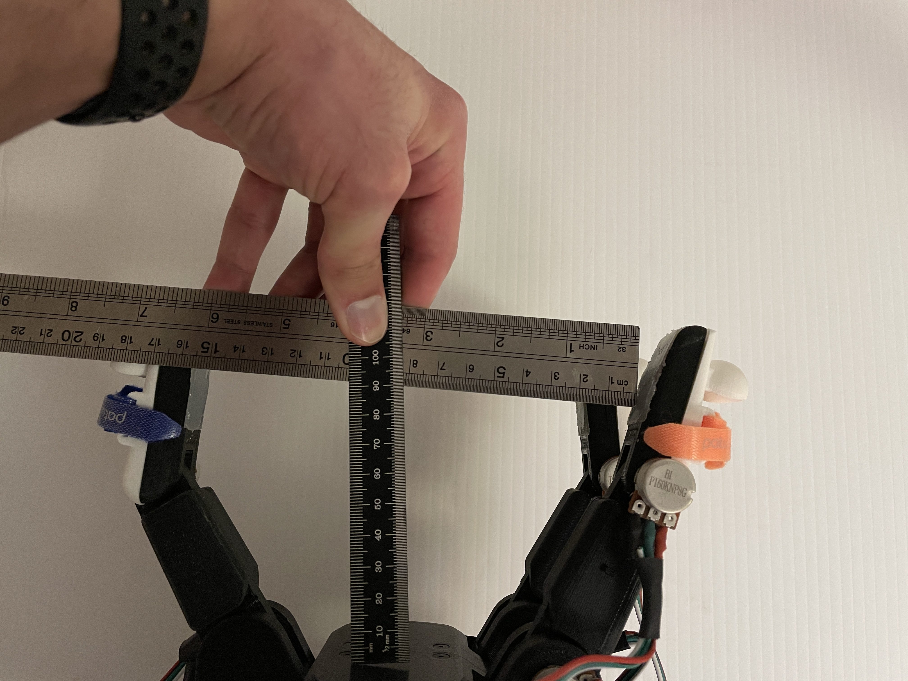
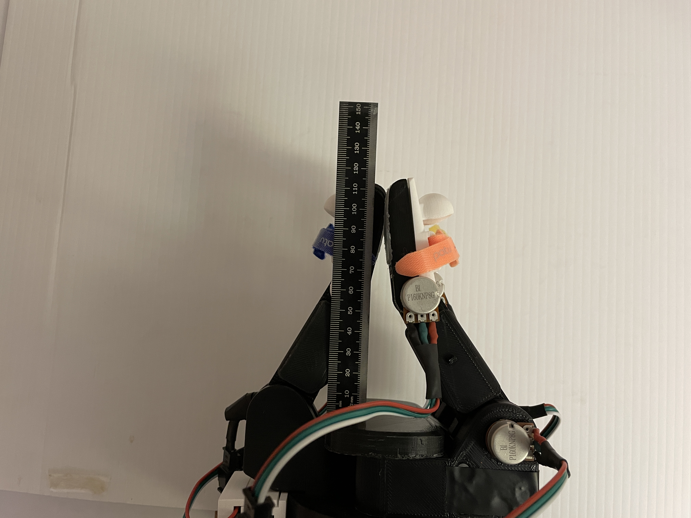

# Barrett Precision Grasp Measurments

### Abs. Max Pose

Span = 30.8cm
Depth = 1.2cm

### Max Pose with Distals at 30 Degrees

Span = 26.5cm
Depth = 2.7cm

### Intermediate Pose

Span = 16.7cm
Depth = 8.7cm

### Min Pose

Span = 0.0cm
Depth = 9.0cm
