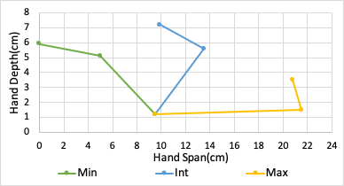
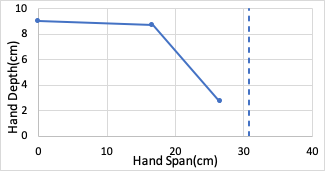

# Results Of Barrett Measurements

### Power Grasp
<image>

</image>
<table>
    <thead>
        <tr>
            <th colspan=7> Barrett Power Grasp </th>
        </tr>
    </thead>
    <tbody>
        <tr>
            <th rowspan=2> Finger   Pose</th>
            <th colspan=2> Distal </th>
            <th colspan=2> Mid </th>
            <th colspan=2> Base </th>
        </tr>
        <tr>    
            <th colspan=1> Span </th>
            <th colspan=1>Depth</th>
            <th colspan=1> Span </th>
            <th colspan=1>Depth</th>
            <th colspan=1> Span </th>
            <th colspan=1>Depth</th>
        </tr>
        <tr>
            <th colspan=1> Max </th>
            <td colspan=1> 20.8 </td>
            <td colspan=1> 3.5 </td>
            <td colspan=1> 21.5 </td>
            <td colspan=1> 1.5 </td>
            <td colspan=1> 9.5 </td>
            <td colspan=1> 1.2 </td>
        </tr>
        <tr>
            <th colspan=1> Int </th>
            <td colspan=1> 9.9 </td>
            <td colspan=1> 7.2 </td>
            <td colspan=1> 13.5 </td>
            <td colspan=1> 5.6 </td>
            <td colspan=1> 9.5 </td>
            <td colspan=1> 1.2 </td>
        </tr>
        <tr>
            <th colspan=1> Min </th>
            <td colspan=1> 0.0 </td>
            <td colspan=1> 5.9 </td>
            <td colspan=1> 5.0 </td>
            <td colspan=1> 5.1 </td>
            <td colspan=1> 9.5 </td>
            <td colspan=1> 1.2 </td>
        </tr>
    </tbody>
</table>

### Precision Grasp

<image>

</image>

<table>
    <thead>
        <tr>
            <th colspan=7> Barrett Precision Grasp </th>
        </tr>
    </thead>
    <tbody>
        <tr>           
            <th colspan=1> Finger Pose </th>
            <th colspan=1> Span </th>
            <th colspan=1>Depth</th>
        </tr>
        <tr>
            <th colspan=1> Abs. Max </th>
            <td colspan=1> 30.8 </td>
            <td colspan=1> 1.2 </td>
        </tr>
        <tr>
            <th colspan=1> Max </th>
            <td colspan=1> 26.5 </td>
            <td colspan=1> 2.7 </td>
        </tr>
        <tr>
            <th colspan=1> Int </th>
            <td colspan=1> 16.7 </td>
            <td colspan=1> 8.7 </td>
        </tr>
        <tr>
            <th colspan=1> Min </th>
            <td colspan=1> 0.0 </td>
            <td colspan=1> 9.0 </td>
        </tr>
    </tbody>
</table>
 
 

### Width:
Max= 9.0+cm Min= 4.3cm
