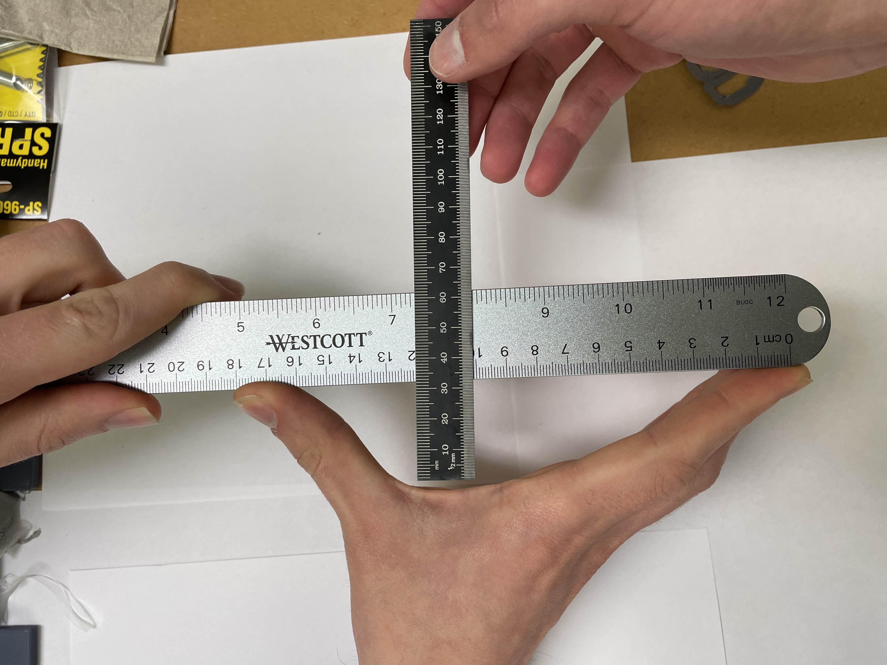
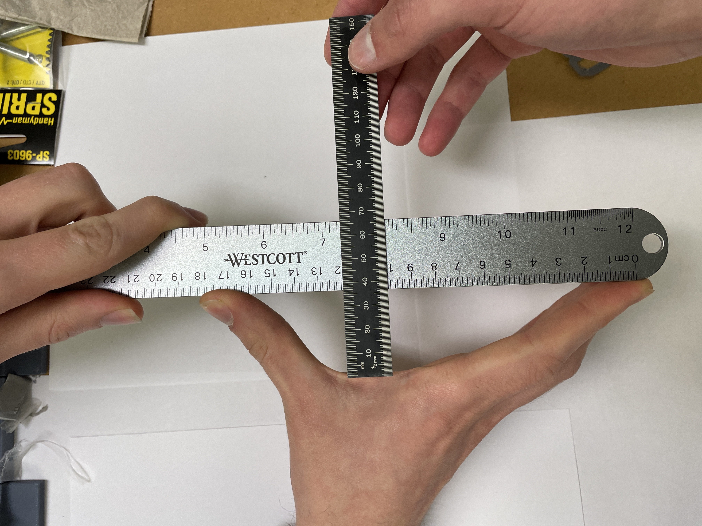
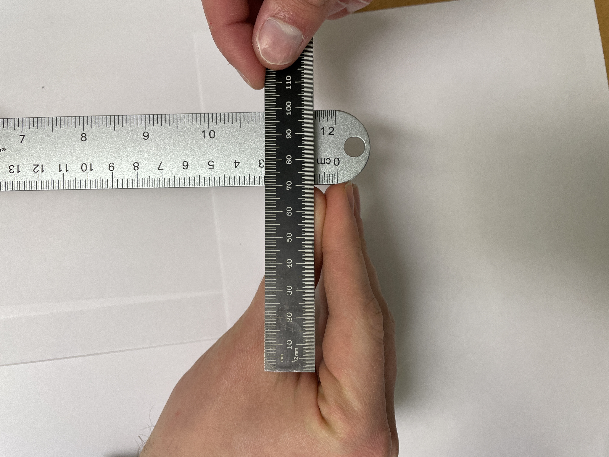

# Human Hand Precision Grasp Measurments

### Absolute Max Pose

Span = 17.5cm
Depth = 3.1cm

### Max Pose with Distals at 30 Degrees

Span = 14.5cm
Depth = 5.3cm

### Intermediate Pose

Span = 10.0cm
Depth = 6.7cm

### Min Pose

Span = 0.0cm
Depth = 6.0cm
