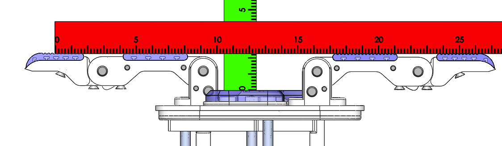
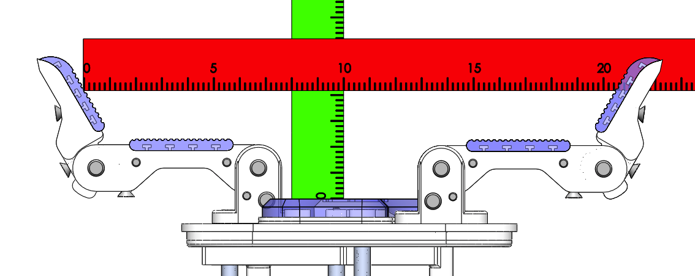
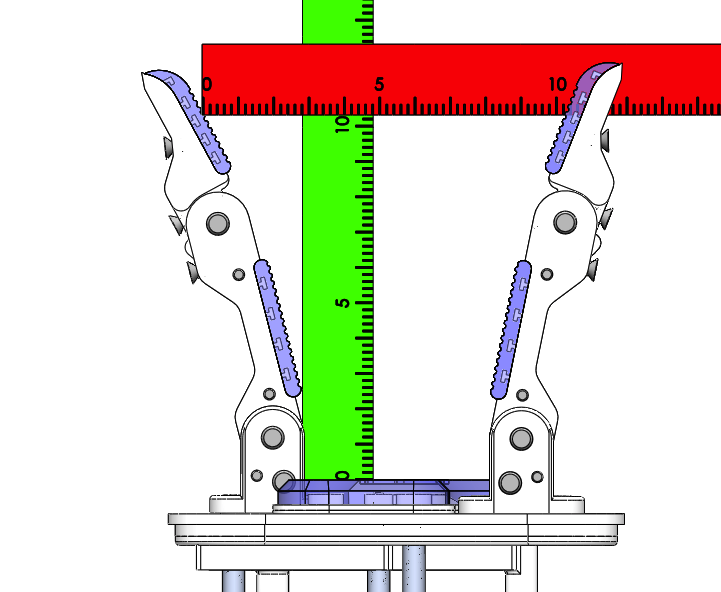
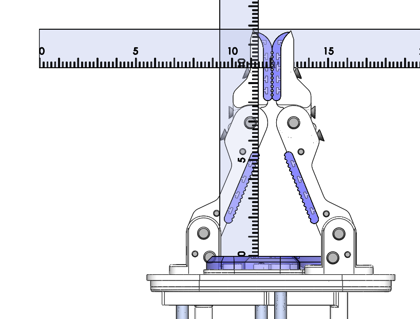

# Model O Cylindrical Precision Grasp Measurments

### Abs. Max Pose

Span = 25.3cm
Depth = 2.3cm

### Max Pose with Distals at 30 Degrees

Span = 20.5cm
Depth = 4.2cm

### Intermediate Pose

Span = 10.25cm
Depth = 10.3cm

### Min Pose

Span = 0cm
Depth = 9.8cm
