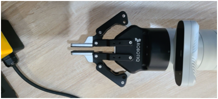

# Robotiq 2f-85 Precision Grasp Measurments

### Abs. Max Pose

Span = 8.5cm
Depth = 4.5cm

### Max Pose
(Max span is the same as the abs. Max span)

Span = 8.5cm
Depth = 4.5cm

### Intermediate Pose

Span = 1.0cm
Depth = 5.5cm

### Min Pose

(No min span image provided)

Span = 0.0cm
Depth = 4.0cm
